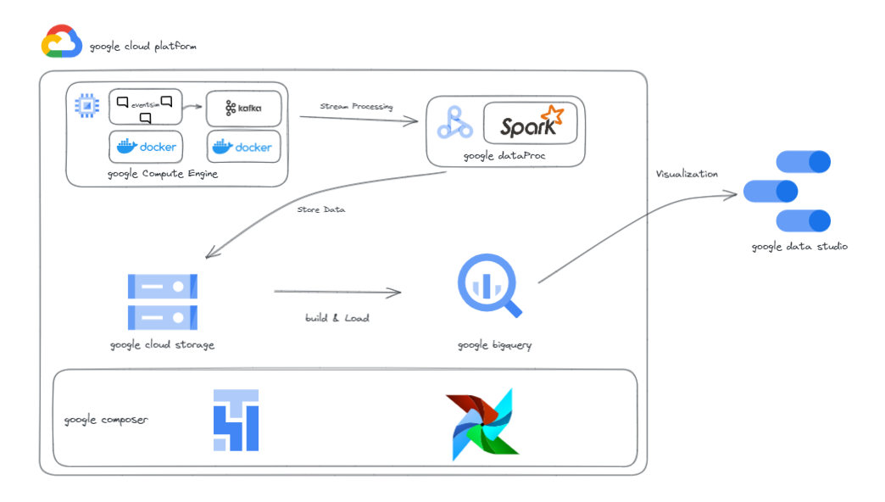

# Introduction
GCP Data 분석 플랫폼을 구축해보는 Toy Project입니다.

## Architecture

- 이번 Toy Project에서는 아래와 같은 아키텍쳐를 가집니다. 위의 환경을 구축해보는 프로젝트 입니다.
    #### 구축과정
        1. [kafka 구축](kafka/README.md)
        2. []
        

#### Scenario
    1. eventsim & Kafka 구축 
    2. DataProc안에 Spark Streaming구축 및 GCS로 데이터 이관
    3. Composer(Airflow)를 이용하여 및 GCS에서 Bigquery로 이관 
    4. GCS to Bigquery로 이관시 DBT로 데이터 빌드 
    5. DataStudio와 연결하여 데이터 시각화

#### 툴 및 기술
- Cloud - [**Google Cloud Platform**](https://cloud.google.com)
- Containerization - [**Docker**](https://www.docker.com), [**Docker Compose**](https://docs.docker.com/compose/)
- Stream Processing - [**Kafka**](https://kafka.apache.org), [**Spark Streaming**](https://spark.apache.org/docs/latest/streaming-programming-guide.html)
- Orchestration - [**Airflow**](https://airflow.apache.org)
- Transformation - [**dbt**](https://www.getdbt.com)
- Data Lake - [**Google Cloud Storage**](https://cloud.google.com/storage)
- Data Warehouse - [**BigQuery**](https://cloud.google.com/bigquery)
- Data Visualization - [**Data Studio**](https://datastudio.google.com/overview)
- Language - [**Python**](https://www.python.org)